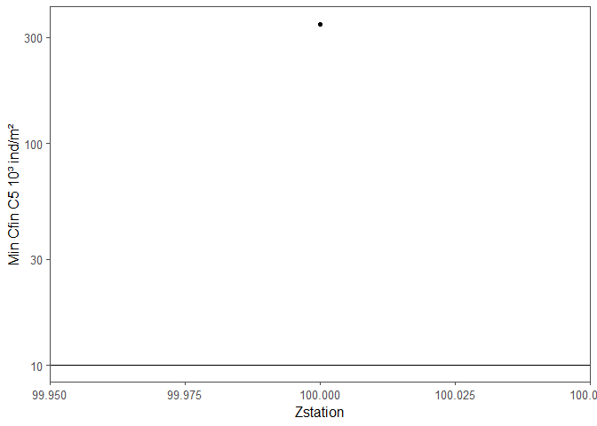

<!-- README.md is generated from README.Rmd. Please edit that file -->

# narwbio

<!-- badges: start -->
<!-- badges: end -->

The package uses the bioenergetic model implemented in: Lehoux, C.,
Plourde S., and Lesage, V. 2020. Significance of dominant zooplankton
species to the North Atlantic Right Whale potential foraging habitats in
the Gulf of St. Lawrence: a bio-energetic approach. DFO Can. Sci. Advis.
Sec. Res. Doc. 2020/033. iv + 44 p.

The original model was published by: Gavrilchuk, Katherine, et
al. “Foraging habitat of North Atlantic right whales has declined in the
Gulf of St. Lawrence, Canada, and may be insufficient for successful
reproduction.” Endangered Species Research 44 (2021): 113-136.

AND

Gavrilchuk, K., Lesage, V., Fortune, S., Trites, A.W., and Plourde, S.
2020. A mechanistic approach to predicting suitable foraging habitat for
reproductively mature North Atlantic right whales in the Gulf of
St. Lawrence. DFO Can. Sci. Advis. Sec. Res. Doc. 2020/034. iv + 47 p.

The Lehoux et al. implementation of this model include more species in
the total biomass and the ENet definition is different. The NARW is
expected to target one depth layer where its Enet is maximum. Enet is
calculated at each position.

This package works with the vertical distribution of C.hyp that includes
its development index (Comtois et al. in prep). This vertical
distribution tends to decrease the level of overestimation which was a
problem with Lehoux et al. 2020. We are discussing a publication for the
valdiation of our vertical distribution models for 2023.

If you have Calanus abundances instead of dry weight, use Plourde et
al. 2019 for conversion. Can be integrated in the future…

The models from Lehoux et al. are priorize when the Region is set to gsl
and season and Day_Night are available, otherwise, models from Plourde
et al. 2019 are used.

The package now accomodate and export for different state resting,
pregnant and lactating. and sensitivity of parameters is now allowed

New column is exported for minimum density of preys.

## Installation

You can install the development version of narwbio like so: since this
is not a public repository, your R studio must be connected to Github.
First use:

``` r
credentials::set_github_pat() 
```

if you have already entered a token on your computer, this should not do
anything visible and then install the package:

``` r
devtools::install_github("clehoux/narwbio")
#> Using github PAT from envvar GITHUB_PAT
#> Downloading GitHub repo clehoux/narwbio@HEAD
#> 
#>          checking for file 'C:\Users\lehouxc\AppData\Local\Temp\1\RtmpYjkahJ\remotes361835e43662\clehoux-narwbio-e908c324096fc7ec5c9204a495904237df3977fb/DESCRIPTION' ...  ✔  checking for file 'C:\Users\lehouxc\AppData\Local\Temp\1\RtmpYjkahJ\remotes361835e43662\clehoux-narwbio-e908c324096fc7ec5c9204a495904237df3977fb/DESCRIPTION'
#>       ─  preparing 'narwbio':
#>    checking DESCRIPTION meta-information ...  ✔  checking DESCRIPTION meta-information
#>       ─  checking for LF line-endings in source and make files and shell scripts
#>   ─  checking for empty or unneeded directories
#>       ─  building 'narwbio_0.1.0.tar.gz'
#>      
#> 
library(tidyverse)
#> ── Attaching packages
#> ───────────────────────────────────────
#> tidyverse 1.3.2 ──
#> ✔ ggplot2 3.3.6      ✔ purrr   0.3.5 
#> ✔ tibble  3.1.8      ✔ dplyr   1.0.10
#> ✔ tidyr   1.2.1      ✔ stringr 1.4.1 
#> ✔ readr   2.1.3      ✔ forcats 0.5.2 
#> ── Conflicts ────────────────────────────────────────── tidyverse_conflicts() ──
#> ✖ dplyr::filter() masks stats::filter()
#> ✖ dplyr::lag()    masks stats::lag()
```

## Example

``` r
dat <-  data.frame(Label="label1", Z_Cf.Cg4.6_mgm2=1000, Z_Ch4.6_mgm2=10000,Z_Pcal.Micro.Scol_mgm2=100,Z_Tem.Eury_mgm2=100, Day_Night="D", Zstation=100, season="esum", MeshSize=333)

library(narwbio)
res_out<- execute_bioenergy(dat, #dataframe like zooimage
                            cfin = "Z_Cf.Cg4.6_mgm2", #column names for cfin dw
                            chyp = "Z_Ch4.6_mgm2", # column names for chyp dw
                            psca = "Z_Pcal.Micro.Scol_mgm2", 
                            temo = "Z_Tem.Eury_mgm2",
                            cfinZ = NULL, #optionnaly in cases of 3D model output mostly for Nicolas Lecorre
                            chypZ = NULL,
                            pscaZ = NULL,
                            temoZ = NULL,
                            units = "mg", #units of dry weight
                            ID = "Label",# unique Idientifier. for the whole zooimage dataset use Label and SampleAnalysis pasted together.
                            change_150m = T) # T for th Gavrilchuk model , F for exploration.
#> Warning in execute_bioenergy(dat, cfin = "Z_Cf.Cg4.6_mgm2", chyp =
#> "Z_Ch4.6_mgm2", : To estimate the vertical distribution, you must include column
#> for season or Month. Month is missing and set to NA and can lead to missing
#> results
#> Warning in execute_bioenergy(dat, cfin = "Z_Cf.Cg4.6_mgm2", chyp =
#> "Z_Ch4.6_mgm2", : To estimate the vertical distribution outside of the GSL, you
#> must include column for Region. Region is set to Gulf of St Lawrence (gsl) and
#> can lead to misleading results
#>   |                                                          |                                                  |   0%  |                                                          |==================================================| 100%

res_out
#>    Label Z_Cf.Cg4.6_mgm2 Z_Ch4.6_mgm2 Z_Pcal.Micro.Scol_mgm2 Z_Tem.Eury_mgm2
#> 1 label1            1000        10000                    100             100
#>   Day_Night Zstation season MeshSize   ED.max ED.max_Z NARW_Ein NARW_Eout.preg
#> 1         D      100   esum      333 86.89381       80 430.1482       1843.707
#>   NARW_Enet.preg Minimum_prey_density_gm3
#> 1     -0.7666939                 1.549273
```

## Example to get minimum density

``` r
dat <-  data.frame(Label="label1", Z_Cf.Cg4.6_mgm2=1000, Z_Ch4.6_mgm2=10000,Z_Pcal.Micro.Scol_mgm2=100,Z_Tem.Eury_mgm2=100, Day_Night="D", Zstation=100, season="esum", MeshSize=333)

library(narwbio)
res_out<- execute_bioenergy(dat, #dataframe like zooimage
                            cfin = "Z_Cf.Cg4.6_mgm2", #column names for cfin dw
                            chyp = "Z_Ch4.6_mgm2", # column names for chyp dw
                            psca = "Z_Pcal.Micro.Scol_mgm2", 
                            temo = "Z_Tem.Eury_mgm2",
                            cfinZ = NULL, #optionnaly in cases of 3D model output mostly for Nicolas Lecorre
                            chypZ = NULL,
                            pscaZ = NULL,
                            temoZ = NULL,
                            units = "mg", #units of dry weight
                            ID = "Label",# unique Idientifier. for the whole zooimage dataset use Label and SampleAnalysis pasted together.
                            change_150m = T,
                            state="pregnant",
                            param="mean") # T for th Gavrilchuk model , F for exploration.
#> Warning in execute_bioenergy(dat, cfin = "Z_Cf.Cg4.6_mgm2", chyp =
#> "Z_Ch4.6_mgm2", : To estimate the vertical distribution, you must include column
#> for season or Month. Month is missing and set to NA and can lead to missing
#> results
#> Warning in execute_bioenergy(dat, cfin = "Z_Cf.Cg4.6_mgm2", chyp =
#> "Z_Ch4.6_mgm2", : To estimate the vertical distribution outside of the GSL, you
#> must include column for Region. Region is set to Gulf of St Lawrence (gsl) and
#> can lead to misleading results
#>   |                                                          |                                                  |   0%  |                                                          |==================================================| 100%

resa<- expand_grid(res_out, Zsampled=seq(10,500, 10)) %>%  filter(Zsampled <=Zstation) %>%  mutate(percZ_stn=Zsampled/Zstation*100) 

resa$prop_biom_cum= predict(mcfin_glac_c_gsl_esum_D, resa, type="response")
test<-  resa %>% ungroup() %>% filter(Zstation >10) %>%  arrange(Label, Zsampled) %>% group_by(Label) %>%  mutate(prop_biom=c(first(prop_biom_cum),diff(prop_biom_cum, lag = 1)))


maxdf <- test %>% filter(ED.max_Z==Zsampled) %>%  mutate(MinDensity_cfinc5_gm3=Minimum_prey_density_gm3,
                                                         MinDensity_cfinc5_mgm3=MinDensity_cfinc5_gm3*1000,
                                                         Min_cfinc5_indm3=MinDensity_cfinc5_mgm3/0.3,
                                                         Min_cfinc5_indm2=Min_cfinc5_indm3/(prop_biom/10))#porportion is calculated on 10m3

library(ggthemes)
ggplot(maxdf %>%  filter(Zstation < 400), aes(x=Zstation, y=Min_cfinc5_indm2/1000)) +geom_point() +geom_hline(yintercept=10)+theme_few() + ylab("Min Cfin C5 10³ ind/m²") +scale_y_continuous(trans="log10")
```


